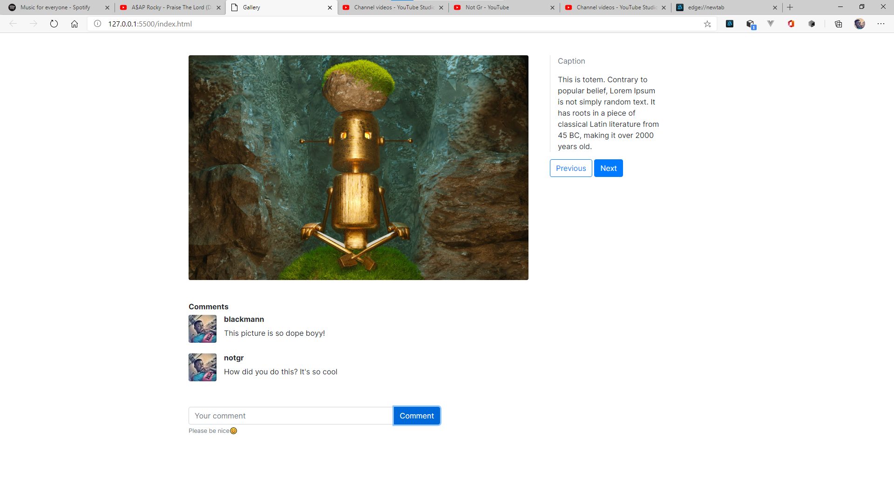

## Back story
You are the frontend developer of a software company. You are tasked to develop the `Photo Detail` page.
The page should match what the designer gave you.

## Requirement
- Display photo, caption and comments of current photo.
- Provide an input field to take comments. And a button to save comment.
- Provide `Previous` and `Next` buttons to slide through images
- Publish your code on Github with repo name `c001start` and submit the link to me on Discord

## Tips
- Try to solve the easy parts first, before moving on to the parts that you think are difficult.
- You can use your own choice of colors
- You can any CSS library you want. Bulma, Bootstrap, etc

#

## Be creative